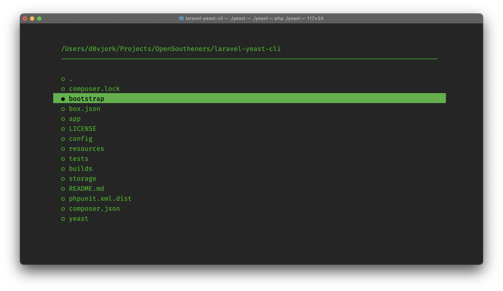

# Laravel Console File Menu [](https://www.php.net/supported-versions.php) [](https://codecov.io/gh/open-southeners/laravel-console-file-menu) [](https://vscode.dev/github/open-southeners/laravel-console-file-menu)

Like NunoMaduro's [console menu package](https://github.com/nunomaduro/laravel-console-menu) but for files.



## Getting started

```
composer require open-southeners/laravel-console-file-menu
```

Start using it by copying code from below:

```php
use NunoMaduro\LaravelConsoleMenu\Menu;

// In between your command's code:
$result = $this->fileMenu('/base/path')
    // Customise the underlying menu here: https://github.com/php-school/cli-menu?tab=readme-ov-file#appearance
    ->customise(fn (Menu $menu) => $menu->setForegroundColour('green')
        ->setBackgroundColour('black')
    )
    ->onlyDirectories(false)
    ->hideFileExtensions(false)
    ->respectIgnored(true)
    ->open();

// $result will contain the full file/directory selected path or null otherwise
```

## Partners

[](https://getskore.com)

## License

This package is open-sourced software licensed under the [MIT license](https://opensource.org/licenses/MIT).
